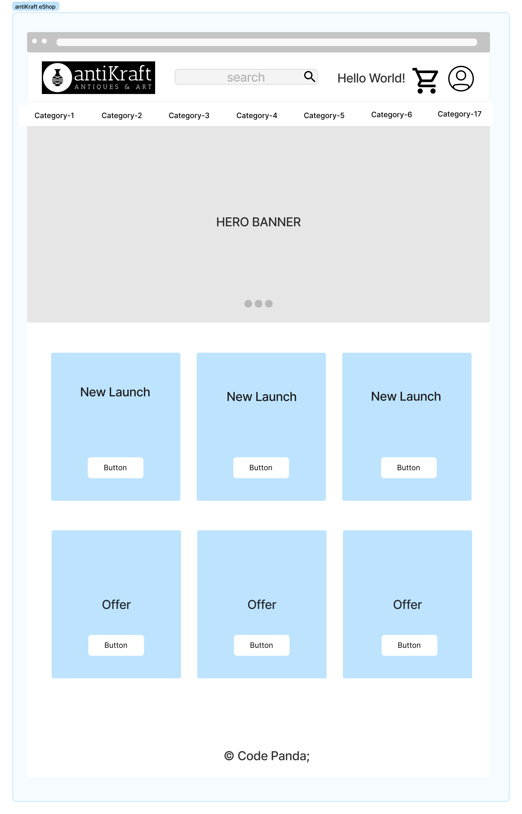

# **AntiKraft eShop Codebase**
AntiKraft is an eCommerce platform to buy or sell antique art and artifacts across a wide range of categories.

### **Team Members :**

| Student ID | Name |  Email ID |
|----------|:-------------:|------:|
| 244815 | Supriya Upadhyaya | supriya.upadhyaya@st.ovgu.de |
| xxxxxx | Aarathi |   aarathi@st.ovgu.de |
| 241215 | Aneesh Sathyan | aneesh.pindalavalappil@st.ovgu.de |

### <br/><br/>**Logo :** 
<figure> <figcaption>eShop Logo</figcaption> </figure>  <figure> <figcaption>Team Logo</figcaption> </figure>

### <br/><br/>**Technology stack :**
    Python with Flask
    HTML + CSS + Bootstrap
    SQLite 
    Web Server : Gunicorn
    Local directory / Cloud storage manage images

### <br/><br/>**Steps to run the application :**
1. Clone the "antikraft-eshop" repository to local
2. Install the pre-requisites mentioned in requirement.txt using ```pip install```
3. Execute below command from the "antikraft-eshop" directory: ```gunicorn -w 4 'antikraft-app:app'```

### <br/><br/>**Project directory Structure :**
    antiKraft-eshop/
    ├── backend                  // Business logic and DB CRUD operation
    │   ├── controller.py
    │   └── model.py
    ├── images                   // Product images uploaded by seller, can be moved to cloud storage
    │   └── dummy.png
    ├── static                   // CSS, images and other static content
    │   ├── logo
    │   ├── team-logo
    │   ├── Architecture.drawio
    │   ├── Architecture.png
    │   └── homepage.png
    ├── templates                // UI - htmls
    │   ├── homepage
    │   ├── product-page
    │   └── base.html
    ├── tests                    // Test cases
    │   └── test.py
    ├── LICENSE
    ├── README.md
    ├── antikraft-app.py
    ├── requirements.txt         // Pre-requisites to be installed
    └── schema.sql               // Sqlite database schema

### <br/><br/>**Architecture :**


### <br/><br/>**Homepage Layout :**



